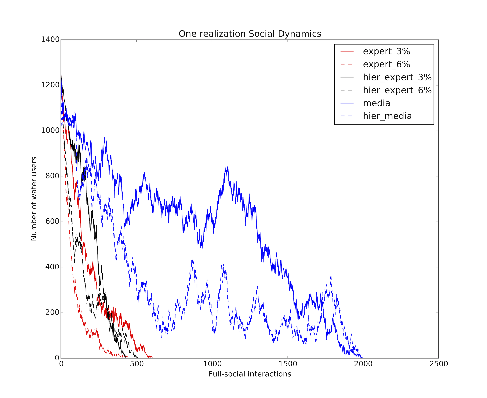
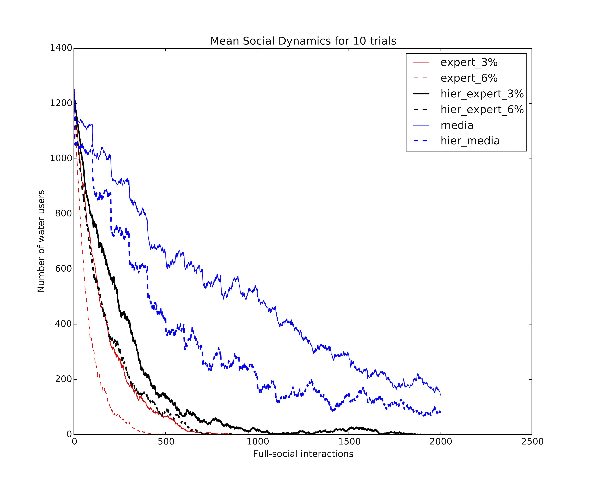
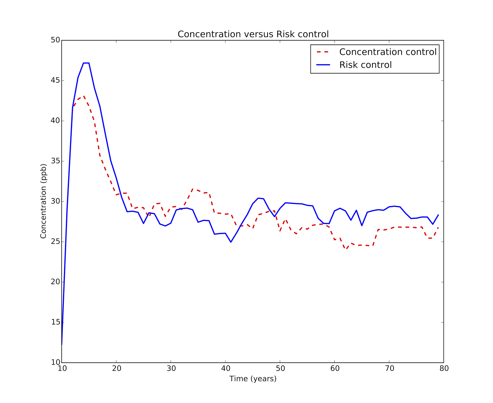

# Examples

This page gives an idea on how to use this hybrid Social-Hydrological simulation package.

## Which social model to use

Social modeling is far from being a precise science; it is still an art and should be treated so accordingly. This means that a good model is only obtained after exploring and combining multiple social models. The social dynamics used in this package is simple but easily expandable. Here is a comparison of the number of 'believers' in all the social models included in this package.

Every realization is different than the other given the stochastic nature of agent-based models. A mean behavior can be computed by averaging multiple realizations.

## Concentration vs. Risk

A main concern in environmental decisions is what to aim for. Usually, regulators aim for reducing the concentration of a contaminated water, but what if we use health risk as a control variable? Would it make a difference? The comparison is not always so obvious.

