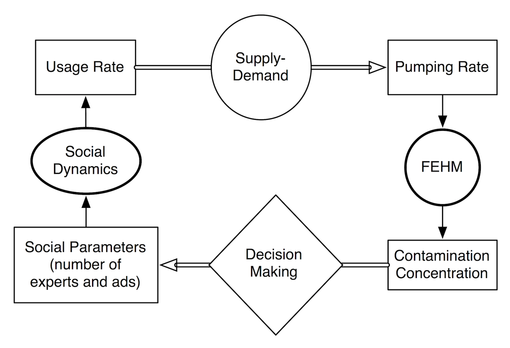

# Introduction

This package simulates social dynamics coupled with underground water contamination (using the Finite Element Heat and Mass (FEHM) package). The purpose of this simulator is to set up a versatile and easy use decision support system (DSS) for environmental dynamics impacted by human behavior. This page gives an idea of the social dynamics and its coupling with hydrological models. For more details, please refer to this [paper]().

FEHM can be downloaded from [here](https://fehm.lanl.gov/). The social models used in the following simulations are derived from the framework presented in [this paper](http://groups.csail.mit.edu/belief-dynamics/MURI/papers07/Pagedblcoord14.png). 

## Problem Statement

The social-hydrological simulation is setup as follows. A small society (a few thousand people) living in a quasi-independent region has a single nearby aquifer as a source of drinking water. Over the years, contaminants have infiltrated the aquifer due to improperly stored waste in its vicinity. Given that the water-supply pumping well is near a contamination plume (see Figure 1), the contaminant concentration distribution in the aquifer is a ected by the pumping rate. In addition, the contaminant concentration in the supplied water depends on the pumping rate, which in turn is controlled by water demand. In the simplest economic case, the pumping rate is proportional to the water demand.

By properly monitoring groundwater contamination, social regulations are created to limit the amount of pumping from the well in order to decrease its contaminant concentration, thus protecting the community from its health dangers. This creates a feedback process whereby social demand affects the contaminant concentration via the pumping rate and the contamination of the groundwater affects the demand by means of socio-political regulations and observed health hazards.

The pumping rate is controlled by two opposing factors. On one hand, the community depends on the water supplied from the aquifer and to stop using it would disrupt their economy; i.e. water pumping from a local aquifer should be maximized. On the other hand, the more contaminated water is used by the population, the higher the health risks; i.e. the pumping rate should be minimized. This is a typical environmental scenario: economy vs. health.

## Social Modeling

Society behaves according to its beliefs and habits. Both beliefs and habits follow the forces of conformity and consistency. Conformity is the tendency of individuals to mirror their social circle. Consistency is the tendency of individuals to have consistent attributes by minimizing the contradictions within their own beliefs and actions. Every individual can be represented as a vector of attributes; in particular, the attributes can be binary: believes water is contaminated or does not believe the water is contaminated, uses the water or does not use the water etc.

The methods by which regulators control society are proposed to be of two sorts: expert and media influence. Media affects public opinion via media outlets in a distributed fashion. Experts affect public beliefs through convincing arguments and fixed informed beliefs. Thus, media influence is coded as broadcasting flipping bits. Experts are coded as a set of individuals with fixed belief attribute. 

A potential use of social dynamics with social networks is facilitated by introducing a rate-of-interaction classification tree depending on how often people interact. People within smaller circles tend to interact more often than people within larger circles.

## Water Contamination

In this case, the water contamination in an aquifer is simulated by FEHM

## Control in Coupling Socio-Hydological Dynamics

Given the two interacting system: society and the environment; we would like to affect public opinion in such a way to minimize public health hazards. The feedback nature of the system enables us to use control theory for finding the optimal decision strategy.

Accordingly, we can use PID control for controlling the amount of expert and media influence regulators wish to confer. This is done by analogy. The reference is the desired health risk threshold or concentration. The plant is the environment-society system. The controller is the regulators. The measurement feedback unit is also part of the regulators as shown in the imgure.

This computational framework presents a systematic yet simple methodology to explore the decision space of a nonlinear stochastic system.

See the [functions](functions.md) page for details on how to use the package and the [examples](examples.md) page for more information on potential results.

